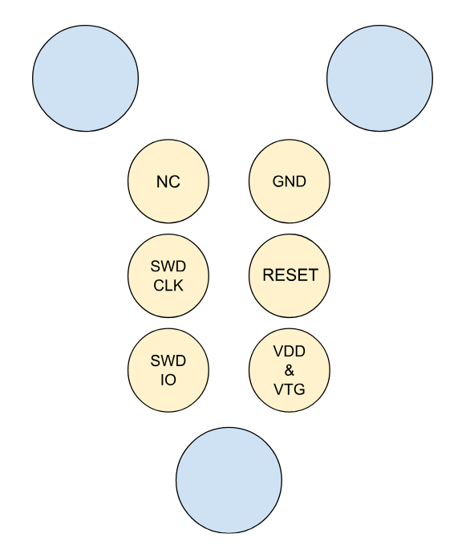

# VersaSens_FW

## 🛠️ Prerequisites

1. **NRF Connect Toolchain (v2.5.0) and SDKs (v2.5.0)**
    - Download and install the NRF-Connect for Desktop application from the [official Nordic Semiconductor website](https://www.nordicsemi.com/Products/Development-tools/nRF-Connect-for-Desktop).
    - Follow the instructions provided in the application to install the required toolchain and SDKs.

2. **NRF Command Line Tools**
    - Download and install the NRF Command Line Tools from the [official Nordic Semiconductor website](https://www.nordicsemi.com/Products/Development-tools/nRF-Command-Line-Tools).

3. **NRF Connect for VS Code**
    - Install the NRF Connect extension for Visual Studio Code using the Toolchain Manager found in nRF Connect for Desktop.

## 🚀 Building and Flashing the Firmware

1. **Build Configuration**
   - Open the project in Visual Studio Code.
   - Use the NRF Connect extension to configure the build with the target set as `nrf5340dk_nrf5340_cpuapp`.
   - Ensure that the SDK and toolchain active for the workspace are version 2.5.0.

2. **Build**
   - Using the interface provided by NRF Connect for VS Code, select the **Build** action to compile the project.

3. **Flash**
   - Connect the programmer to your computer.
   - Using the interface provided by NRF Connect for VS Code, select the **Flash** action to upload the firmware to the device.

To flash the VersaSens, connect it to an nRF5340DK used as a programmer. 
The image below shows how the programming pins should be connected to the nRF5340DK.



### Build options

To optimize memory usage, you can exclude specific sensors from the build by defining the corresponding disable macros in the `sensors_list.h` file. This will prevent the firmware from including the drivers and logic for the excluded sensors, reducing the overall memory footprint.

#### How to Exclude Sensors

1. Open the `sensors_list.h` file.
2. Uncomment the `#define` statement for the sensor you want to exclude.

For example, to exclude the `ADS1298` and `T5838` sensors, modify the file as follows:

```c
// Use this define to exclude a sensor from the build
#define ADS1298_DISABLE
// #define BNO086_DISABLE
// #define MAX30001_DISABLE
// #define MAX86178_DISABLE
// #define MLX90632_DISABLE
#define T5838_DISABLE 
```

By excluding unnecessary sensors, you can significantly reduce the memory usage of the firmware, making it more efficient and better suited for your specific application. 

## 📄 Firmware Description

### 📂 Drivers
The drivers folder includes the drivers and logic to manage the various sensors available on the VersaSens Platform. This encompasses initialization, configuration, and real-time data acquisition. The drivers also handle the SD card interface used for storage, the BLE interface to enable real-time streaming of measurement data, as well as the logic for communication with the Heepocrates co-processor.

### Supported Sensors
The current version of the firmware implements drivers for the following sensors:
- **ADS1298**: Electrocardiography & Electromyography & Electroencephalography analog front end
- **BNO086**: Accelerometer
- **MAX30001**: Electrodermal activity & Respiration front end
- **MAX77658**: Battery charger & Fuel gauge
- **MAX86178**: Photoplethysmography & Electrocardiography & Respiration front end
- **MLX90632**: Infrared temperature sensor
- **T5838**: Microphone

### 📚 API
The VersaSens API manages the initialization of the VersaSens, the operating modes, and the switch and LEDs present on the main module.

#### VersaAPI Functions
The following functions are available:
- **versa_start_led_thread**: Starts the LED thread that indicates the status of the device.
- **versa_start_mode_thread**: Starts the mode thread that manages the mode depending on the switch of the main board.
- **versa_init**: Initializes storage memory, PMU, BLE, and sensors marked as active.
- **versa_config**: Configures the sensors marked as active.
- **versa_sensor_start**: Starts the continuous reading of the sensors marked as active.
- **versa_sensor_stop**: Stops the continuous reading of the sensors marked as active.
- **enable_auto_connect**: Starts the thread that automatically initializes new modules when they are connected.
- **disable_auto_connect**: Stops the thread that automatically initializes new modules when they are connected.

#### Versa Config
The following configuration options are available in the file `src/VersaAPI/versa_config.h`:
- Enabling the drivers of the different sensors
- Selecting which sensor data should be sent to the application running on the VersaSens
- Selecting which sensor data should be sent to the Heepo module
- Selecting the frequency, gain, and subsampling factor for the ADS1298
- Selecting the type of data measured by the MAX30001

## 🎛️ Controls and Operating Modes
The firmware supports three operating modes:
- **Idle mode**: No measurements are being made.
- **Storing mode**: Measurements are being made and saved to the SD card using the FatFS storage system.
- **Streaming mode**: Measurements are being made and stored as in Storing mode. Additionally, the data is streamed through BLE.

The mode is controlled by the switch present on the main module of VersaSens.

## 🛜 Bluetooth Communication and Commands
The application has the following Bluetooth Low Energy services and characteristics:
- **VersaSens Service (UUID: 0xE11D2E00-04AB-4DA5-B66A-EECB738F90F3)**
  - Data Stream Characteristic (UUID: 0xE11D2E01-04AB-4DA5-B66A-EECB738F90F3)
  - Status Characteristic (UUID: 0xE11D2E02-04AB-4DA5-B66A-EECB738F90F3)
  - Command Characteristic (UUID: 0xE11D2E03-04AB-4DA5-B66A-EECB738F90F3)
- **Battery Service (UUID: 0x180F)**
  - Battery Level Characteristic (UUID: 0x2A19)
- **Generic Attribute Service (UUID: 0x1801)**
- **Generic Access Service (UUID: 0x1800)** 

### Streaming
The measurements from the VersaSens are streamed through the Data Stream Characteristic using notifications. To improve data throughput, no acknowledgment system is used for the streaming of the data.

### BLE Commands
The following 1-byte commands can be used to control the mode of the VersaSens:
- `0x01`: Set the current mode to Idle
- `0x02`: Set the current mode to Storing
- `0x03`: Set the current mode to Streaming
- `0x08`: Enable the BLE command to overwrite the mode selected by the switch
- `0x09`: Disable the overwriting of the switch by the BLE commands

The command should be written to the Command Characteristic. An acknowledgment will be returned as an indication with the following format: `cmd sent + 0xA0`.

## 📈 Data Visualization

A Python notebook is available in the `python_notebook` folder. To visualize the data, add the file containing the measurements to the same folder and specify the file path in cell 2 of the notebook. The notebook provides data visualization for all supported sensors.

## 📊 Data Format

In this section, you can find the details of the data format used for saving sensor data. The format is consistent across SD card storage, BLE transmission, and data sent to the app running on VersaSens.

<details>
<summary>MLX90632 Measurement Data Format</summary>

| Field                  | Data Type | Size (in bytes) | Description                                | Example Value (Hex) |
|------------------------|-----------|-----------------|--------------------------------------------|---------------------|
| **Header**             | Hex       | 2               | MLX90632 data header                       | bb bb               |
| **Timestamp seconds**  | uint32    | 4               | Seconds component of the timestamp         | 0b 00 00 00         |
| **Timestamp milliseconds** | uint16 | 2               | Milliseconds component of the timestamp    | 69 00               |
| **Length**             | uint8     | 1               | Length of the remaining part of the packet | 09                  |
| **Index**              | uint8     | 1               | Index incrementing with each measurement   | 02                  |
| **Ambient temperature**| float32   | 4               | Ambient temperature in degrees Celsius     | 7a 36 d8 41         |
| **Object temperature** | float32   | 4               | Object temperature in degrees Celsius      | 2d e1 d7 41         |

</details>

<details>
<summary>T5838 Measurement Data Format</summary>

| Field                  | Data Type | Size (bytes)    | Description                                | Example Value (Hex) |
|------------------------|-----------|-----------------|--------------------------------------------|---------------------|
| **Header**             | Hex       | 2               | T5838 data header                          | aa aa               |
| **Timestamp seconds**  | uint32    | 4               | Seconds component of the timestamp indicating the end of the encoded frame | 09 00 00 00         |
| **Timestamp milliseconds** | uint16 | 2               | Milliseconds component of the timestamp indicating the end of the encoded frame | 80 01               |
| **Length**             | uint8     | 1               | Length of the remaining part of the packet | 37                  |
| **Index**              | uint8     | 1               | Index incrementing with each frame         | 45                  |
| **Compressed frame**   | struct    | variable        | Frame compressed using the OPUS codec      | 28 1e b4 46 7f 18 2a d8 b5 c3 0a d7 09 9b 95 2f d6 33 4b 87 09 bf 39 bd 1f 45 a8 00 00 00 00 00 00 00 00 00 00 00 00 00 00 00 00 00 00 00 00 00 00 00 00 00 00 00 |

</details>

<details>
<summary>BNO086 Measurement Data Format</summary>

| Field                  | Data Type | Size (bytes)    | Description                                | Example Value (Hex) |
|------------------------|-----------|-----------------|--------------------------------------------|---------------------|
| **Header**             | Hex       | 2               | BNO086 data header                         | cc cc               |
| **Timestamp seconds**  | uint32    | 4               | Seconds component of the timestamp of the most recent sample | 07 00 00 00         |
| **Timestamp milliseconds** | uint16 | 2               | Milliseconds component of the timestamp of the most recent sample | bd 02               |
| **Length**             | uint8     | 1               | Length of the remaining part of the packet | 82                  |
| **Index**              | uint8     | -               | Absent as BNO086 measurements already include indexes | -                   |
| **Measurements**       | struct    | 130             | List of 10 consecutive BNO086 samples with the following format | 91 53 0e d5 df 51 d7 59 00 09 fc 0a 00 92 5a 0e d6 df 54 d7 66 00 16 fc e2 ff 93 a9 0e d8 df 0a d7 52 00 20 fc f0 ff 94 24 0f dd df 92 d6 5e 00 1c fc e3 ff 95 b9 0f e3 df 00 d6 6e 00 09 fc b6 ff 96 4e 10 eb df 6e d5 64 00 20 fc bf ff 97 d7 10 f2 df e9 d4 70 00 20 fc fc ff 98 6b 11 fb df 59 d4 62...

#### Measurements Format

| Field     | Type  | Example Value |
|-----------|-------|----------------|
| **Index** | uint8 | 91             |
| **Yaw**   | int16 | 53 0e          |
| **Pitch** | int16 | d5 df          |
| **Roll**  | int16 | 51 d7          |
| **X-accel** | int16 | 59 00         |
| **Y-accel** | int16 | 09 fc         |
| **Z-accel** | int16 | 0a 00         |

</details>

<details>
<summary>MAX30001 Measurement Data Format</summary>

| Field                  | Data Type | Size (in bytes) | Description                                | Example Value (Hex) |
|------------------------|-----------|-----------------|--------------------------------------------|---------------------|
| **Header**             | Hex       | 2               | MAX30001 data header                       | ee ee               |
| **Timestamp seconds**  | uint32    | 4               | Seconds component of the timestamp         | 0b 00 00 00         |
| **Timestamp milliseconds** | uint16 | 2               | Milliseconds component of the timestamp    | ed 00               |
| **Length**             | uint8     | 1               | Length of the remaining part of the packet | 07                  |
| **Index**              | uint8     | 1               | Index incrementing with each measurement   | 0c                  |
| **ECG**                | int24     | 3               | Value of the ECG measurement               | ff f3 d7            |
| **BIOZ**               | int24     | 3               | Value of the BIOZ measurement              | 00 00 06            |

</details>

<details>
<summary>ADS1298 Measurement Data Format</summary>

| Field                  | Data Type | Size (in bytes) | Description                                | Example Value (Hex) |
|------------------------|-----------|-----------------|--------------------------------------------|---------------------|
| **Header**             | Hex       | 2               | ADS1298 data header                        | dd dd               |
| **Timestamp seconds**  | uint32    | 4               | Seconds component of the timestamp         | 0b 00 00 00         |
| **Timestamp milliseconds** | uint16 | 2               | Milliseconds component of the timestamp    | 3a 01               |
| **Length**             | uint8     | 1               | Length of the remaining part of the packet | 19                  |
| **Index**              | uint8     | 1               | Index incrementing with each measurement   | 4b                  |
| **Channel 1**          | int24     | 3               | Voltage measurement for the channel 1      | 00 1f fc            |
| **Channel 2**          | int24     | 3               | Voltage measurement for the channel 2      | d1 ec 57            |
| **Channel 3**          | int24     | 3               | Voltage measurement for the channel 3      | dd 46 4f            |
| **Channel 4**          | int24     | 3               | Voltage measurement for the channel 4      | d6 ed f9            |
| **Channel 5**          | int24     | 3               | Voltage measurement for the channel 5      | 00 20 31            |
| **Channel 6**          | int24     | 3               | Voltage measurement for the channel 6      | da 9c 7b            |
| **Channel 7**          | int24     | 3               | Voltage measurement for the channel 7      | e4 dc 22            |
| **Channel 8**          | int24     | 3               | Voltage measurement for the channel 8      | de c7 7b            |

</details>

<details>
<summary>MAX86178 Measurement Data Format</summary>

| Field                  | Data Type | Size (bytes)    | Description                                | Example Value (Hex) |
|------------------------|-----------|-----------------|--------------------------------------------|---------------------|
| **Header**             | Hex       | 2               | MAX86178 data header                       | 99 99               |
| **Timestamp seconds**  | uint32    | 4               | Seconds component of the timestamp indicating the time the measurement was retrieved from the MAX86178 FIFO | 09 00 00 00         |
| **Timestamp milliseconds** | uint16 | 2               | Milliseconds component of the timestamp indicating the time the measurement was retrieved from the MAX86178 FIFO | 80 01               |
| **Length**             | uint8     | 1               | Length of the remaining part of the packet | 37                  |
| **Index**              | uint8     | 1               | Index incrementing with each frame         | 45                  |
| **FIFO Data**          | struct    | 150             | Content of the MAX86178 FIFO               | b0 8b 09 e0 00 06 00 00 02 10 00 01 2f ff fd 30 00 b6 b0 83 31 e8 00 06 9f ff aa b0 80 54 e0 00 06 0f ff fe 10 00 02 20 00 02 30 00 86 b0 81 23 e8 00 06 9f ff 9f b0 80 30 e0 00 06 0f ff fd 1f ff fc 20 00 02 30 00 ad b0 80 eb e8 00 06 9f ff 96 b0 82 c2 e0 00 06 00 00 00 1f ff fb 20 00 00 30 00...

#### FIFO Data Headers

| Header | Measurement       |
|--------|-------------------|
| 0x0    | PPG LED1          |
| 0x1    | PPG LED2          |
| 0x2    | PPG LED3          |
| 0x3    | PPG Ambient       |
| 0x9    | BIOZ I            |
| 0xb    | ECG data          |
| 0xe    | ECG to BIOZ timing|
| 0xf    | FIFO empty        |

</details>

<details>
<summary>MAX77658 Measurement Data Format</summary>

| Field                  | Data Type | Size (in bytes) | Description                                | Example Value (Hex) |
|------------------------|-----------|-----------------|--------------------------------------------|---------------------|
| **Header**             | Hex       | 2               | MAX77658 data header                       | 88 88               |
| **Timestamp seconds**  | uint32    | 4               | Seconds component of the timestamp         | 0b 00 00 00         |
| **Timestamp milliseconds** | uint16 | 2               | Milliseconds component of the timestamp    | 3a 01               |
| **Length**             | uint8     | 1               | Length of the remaining part of the packet | 09                  |
| **Index**              | uint8     | 1               | Index incrementing with each measurement   | 4b                  |
| **Temperature**        | int16     | 2               | Internal die temperature measurement       | 00 1f fc            |
| **Voltage**            | int16     | 2               | Battery voltage                            | d1 ec 57            |
| **Current**            | int16     | 2               | Battery current                            | dd 46 4f            |
| **SOC**                | int16     | 2               | State of charge of the battery (0xFFFF = 100%; 0x0000 = 0%) | d6 ed f9            |

</details>

## ⚠️ Known Issues
- The initialization of a storage file on the SD card can take a variable amount of time, which increases with the number of files already present. This can result in delays when switching modes.